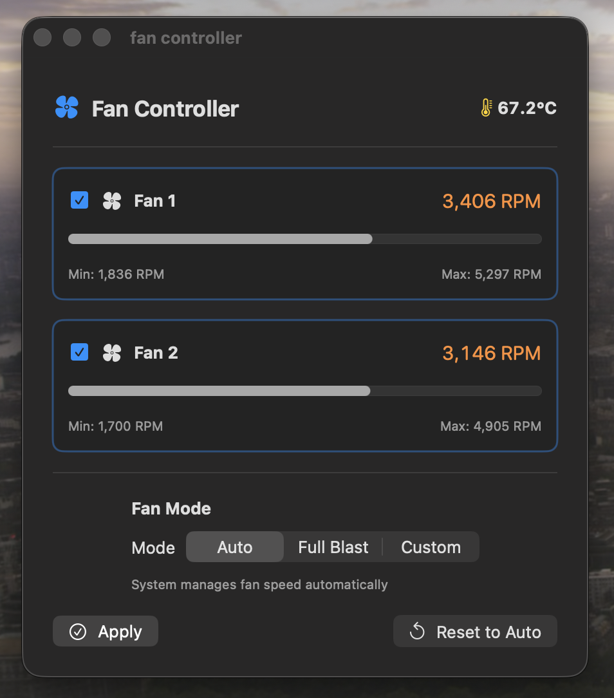

# Mac Fan Controller Pro

A minimal, modern SwiftUI app for controlling the fans on Intel-based Macs (including T2 models like the 2019 MacBook Pro). Choose between **Auto**, **Full Blast**, or a **Custom RPM** mode, apply it to either individual fans or all fans at once, and monitor live RPM and CPU temperature.

<p align="center">
  
</p>

> **Important:** This tool talks directly to the System Management Controller (SMC). Forcing fans outside their normal operating range is inherently risky — you can stress bearings, burn more power, or mask thermal events. Use at your own discretion.

---

## Features

- Live per-fan RPM readout with min/max range
- Live CPU temperature (TC0P) with color indicators
- Three control modes
  - **Auto** — hands back to the firmware's thermal manager
  - **Full Blast** — forces each selected fan to its reported maximum
  - **Custom** — sets a user-defined target RPM (slider goes above reported max for enthusiast headroom)
- Per-fan selection (apply a mode to Fan 1, Fan 2, or both)
- **One password prompt per app launch** — subsequent applies are silent (uses cached `AuthorizationRef`)
- Automatic reset to Auto on app quit (so fans don't stay pinned at full)
- Inline debug log panel for troubleshooting
- Native macOS look, compact window, built on `@Observable` (Swift 6 concurrency-friendly)

---

## Requirements

- **Intel Mac** (including T2 models). Apple Silicon (M1/M2/M3/M4) is **not** supported — those machines use a different fan controller. See [Apple Silicon](#apple-silicon-support) below.
- macOS with Xcode 26 toolchain for building (set `MACOSX_DEPLOYMENT_TARGET` to your macOS version in the project settings if you want to build for older releases).
- Administrator password — required once per app launch to authorize SMC writes.

---

## Installing the Pre-built App

1. Download `mac-fan-controller-pro.zip` from the [Releases](https://github.com/mnaveedpaki/mac-fan-controller-pro/releases) page.
2. Unzip. You'll get `fan controller.app`.
3. Move it to `/Applications` (or anywhere you like).
4. First launch: **right-click → Open** (because the app isn't notarized). Confirm the Gatekeeper warning.
5. Click **Apply** in any mode. macOS will prompt for your password — enter it. Subsequent applies during the same session won't prompt again.

If macOS refuses to open it (e.g. "damaged"), clear the quarantine attribute:

```bash
xattr -dr com.apple.quarantine "/Applications/fan controller.app"
```

---

## Building from Source

```bash
git clone https://github.com/mnaveedpaki/mac-fan-controller-pro.git
cd mac-fan-controller-pro
open "fan controller.xcodeproj"
```

In Xcode:

1. Select the **fan controller** target.
2. Under **Signing & Capabilities**, set your own **Team**.
3. Confirm **App Sandbox is disabled** (required — IOKit SMC access is blocked by the sandbox).
4. Confirm **Hardened Runtime is enabled** (stays on; we just don't need extra entitlements).
5. Build & Run (`Cmd+R`).

---

## Usage

1. Launch the app. The header shows fan count, live CPU temperature, and per-fan cards with current RPM vs. max.
2. Use the **checkboxes** on the fan cards to choose which fans the next Apply will affect.
3. Pick a mode: **Auto** / **Full Blast** / **Custom**.
4. If Custom: drag the slider to the desired RPM. The slider range goes 1.5× above the reported max (or up to 10,000 RPM, whichever is higher) to allow enthusiast overrides. Your SMC may clamp it — see [Why doesn't my Custom RPM stick](#troubleshooting) below.
5. Click **Apply**. Enter your password on the first Apply of the session.
6. **Reset to Auto** returns control to the system firmware.
7. Quitting the app automatically resets fans to Auto.

---

## How It Works

### Architecture

- `SMCKit.swift` — a minimal SMC client that speaks IOKit directly via `IOConnectCallStructMethod` on the `AppleSMC` service. Handles `fpe2` (older Intel), `flt ` (T2-era Float32, little-endian), and `sp78` (temperature) data types.
- `FanManager.swift` — `@Observable` state container. Owns the `SMCKit` instance, manages polling, caches an `AuthorizationRef`, and delegates privileged writes to an in-process helper mode.
- `SMCHelper` (inside `FanManager.swift`) — when the app's own binary is re-invoked with `--smc-helper <command> [rpm] [fanList]`, it runs as root, writes to the SMC, and logs everything to `/tmp/fan-controller.log`.
- `ContentView.swift` — SwiftUI UI with fan cards, per-fan selection, mode picker, custom slider, Apply/Reset, error banner, and a collapsible debug panel.
- `fan_controllerApp.swift` — app entry point that short-circuits into helper mode when `--smc-helper` is present in argv.

### Why Does It Need Admin?

SMC writes are privileged. Reading fan RPM, temperatures, and key metadata works as a normal user, but anything that changes fan state (`FS! ` force bits, `F%dTg` target RPM, `F%dMd` manual-mode flag) requires root. The app invokes its own bundle executable as a child process under root via `AuthorizationExecuteWithPrivileges`. That function is marked unavailable in Swift, so we resolve it via `dlsym` — the symbol still lives in `Security.framework`.

### Why Only One Password Prompt Per Launch?

`AuthorizationExecuteWithPrivileges` takes an `AuthorizationRef`. We create one the first time you click Apply and cache it on the `FanManager` instance. Every subsequent Apply reuses that reference, so macOS doesn't re-prompt. On app quit, the ref is freed (`AuthorizationFree` with `.destroyRights`) and the cached rights are destroyed.

### SMC Keys Used

| Key      | Meaning                              | Access |
|----------|--------------------------------------|--------|
| `FNum`   | Fan count                             | read   |
| `F%dAc`  | Fan actual RPM                        | read   |
| `F%dMn`  | Fan minimum RPM                       | read   |
| `F%dMx`  | Fan maximum RPM                       | read   |
| `F%dSf`  | Fan safe-minimum RPM                  | read   |
| `F%dTg`  | Fan target RPM                        | read/write |
| `F%dMd`  | Fan mode (0 = auto, 1 = manual)        | read/write |
| `FS! `   | Forced-fan bitmask                    | read/write |
| `TC0P`   | CPU proximity temperature (sp78)       | read   |

### The `SMCKeyData_keyInfo_t` Padding Story

Swift embeds nested structs using their `MemoryLayout.size` (9 bytes for that particular struct), while the kernel expects C's `sizeof` which includes trailing alignment padding (12 bytes). The struct in `SMCKit.swift` includes an explicit 3-byte padding tuple so the full outer message is the 80 bytes the kernel expects. Without this, `IOConnectCallStructMethod` returns `kIOReturnBadArgument` (-536870206) and no keys are readable.

---

## Troubleshooting

### "No Fans Detected"

- Confirm **App Sandbox is OFF** in the project settings (Debug and Release).
- Check `/tmp/fan-controller.log` — that log is appended by the privileged helper after you click Apply for the first time. If you see `kIOReturnBadArgument` or similar, the struct alignment fix in `SMCKit.swift` may need adjustment for your macOS version.

### Password Prompt Appears but Fans Don't Change

1. Open `/tmp/fan-controller.log` and paste the output.
2. The helper dumps every known per-fan SMC key (raw bytes, dataType, size) before and after each write. Look at the `F%dTg` read-back. If it differs from what you wrote, the SMC is clamping the value — that's a firmware safety policy and is not bypassable from user space on T2 Macs.

### "Why Doesn't My Custom RPM Stick Above a Certain Value?"

T2 Macs route SMC writes through the T2 security chip, which enforces firmware-level limits. You can typically push fans up to their reported max (e.g. ~5300 / 4900 RPM on a 2019 16" MBP), but requests above that get clamped. This isn't a bug in the app — it's the Secure Enclave refusing an unsafe request.

### App Won't Open After Download

macOS quarantined it. Right-click → Open, or:

```bash
xattr -dr com.apple.quarantine "/Applications/fan controller.app"
```

### Logs

Every privileged operation logs to `/tmp/fan-controller.log`. To reset:

```bash
rm /tmp/fan-controller.log
```

---

## Apple Silicon Support

**Not supported.** On M1/M2/M3/M4 Macs:

- MacBook Air models have no fans at all.
- MacBook Pro / Mac Studio / Mac mini / Mac Pro use a different controller — the keys, the IOKit service, and the data formats all differ.
- Supporting Apple Silicon requires a separate implementation and physical access to the target hardware to probe the correct keys.

Pull requests implementing Apple Silicon support are welcome.

---

## Safety Notes

- Running fans at maximum RPM constantly will wear bearings faster. Use Full Blast for bursts, not as a daily driver.
- Setting a custom RPM below `F%dSf` (the firmware-advertised safe minimum) can trip a thermal event and shut the system down under load. The app's slider minimum already clamps to the lowest `F%dMn` value reported, but `F%dSf` may be higher. Watch CPU temperature.
- The `resetToAuto` call on app quit uses the **same** privileged channel, but if the helper is unavailable for any reason (e.g. auth already torn down), fans may stay pinned. Re-run the app and choose Auto, or reboot.
- There is **no kernel extension** and no background daemon. When the app isn't running, the firmware controls fans as usual.

---

## Development Notes

- Swift 6-ready (uses `@Observable`, `SWIFT_DEFAULT_ACTOR_ISOLATION = MainActor`, `nonisolated` for protocol properties where needed).
- No third-party dependencies. Pure IOKit + SwiftUI + Security.framework.
- The project uses Xcode's **PBXFileSystemSynchronizedRootGroup**, so any `.swift` file you drop into `fan controller/` is automatically part of the target.
- The helper subprocess pattern keeps signing simple — there's no separate helper target, no `SMJobBless` plumbing, no notarized LaunchDaemon. The trade-off: one password prompt per app launch (vs. zero after a one-time helper install).

### Project Layout

```
fan controller/
├── fan_controllerApp.swift   # App entry + --smc-helper dispatch
├── ContentView.swift         # SwiftUI UI + FanCard
├── FanManager.swift          # State, polling, elevated execution, SMCHelper
├── SMCKit.swift              # Low-level SMC client (IOKit)
└── Assets.xcassets           # Icons, accent color
```

---

## Contributing

Issues and PRs welcome. Before submitting a PR:

- Keep changes focused — separate unrelated fixes.
- Test on your Mac model and note it in the PR.
- If you're touching `SMCKit.swift`, include before/after dumps from `/tmp/fan-controller.log` for at least one key read and one key write.
- Don't add analytics, telemetry, or network calls. This app has none and should stay that way.

---

## License

[MIT](LICENSE). See LICENSE for details.

---

## Credits

- SMC key catalogue cross-referenced against Apple's `smc-command` tool and community reverse-engineering efforts.
- Inspired by — but not derived from — tools like Macs Fan Control, smcFanControl, and iStat Menus.
